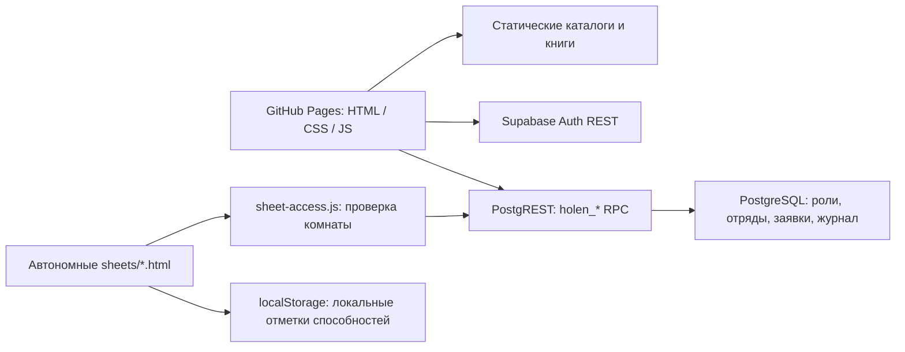

# Техническая карта «Мира Холэна»
Дата сверки: 9 октября 2026. Базовый коммит: `a9822f463a679f509a4cc9ec00b0fc99829058b0`, версия интерфейса 0.11.2.

## Вывод
Контекст восстановлен по актуальному коду, истории GitHub, реальной схеме Supabase и двум доступным чатам. Это работающая онлайн-альфа со статическим фронтендом и серверными командами, а не только локальный макет. Компактный бестиарий и отдельные листы уже существуют. Первый следующий шаг — исправить конфиденциальность журнала здоровья и ограничения серверного доступа; затем проверить интерфейс и добавлять изображения.

Диагностика проводилась только чтением. Рабочая база, ветка main и опубликованный сайт не изменены. Предлагаемые изменения находятся в отдельной ветке; SQL-миграция не применена.

## Подтверждённые источники
- [Репозиторий](https://github.com/Mister-Orio/holen-world), public, main — единственная ветка на момент начала аудита, без защиты ветки.
- [Исходный handoff](https://github.com/Mister-Orio/holen-world/blob/a9822f463a679f509a4cc9ec00b0fc99829058b0/PROJECT_HANDOFF_RU.md): полезная карта, проверенная по коду и базе.
- Чаты «Память последнего чата» и «Создание обложки ваншота». Последний запрос про компактные иконки, отдельную страницу и 1:1/3:4 доступен дословно. Часть прежних ответов представлена только недоступными ссылками; их содержание не восстановлено.
- Supabase `holen-world`, ref `xxxsirbvyjfowyfocost`, Frankfurt, статус ACTIVE_HEALTHY, PostgreSQL 17.11.0.003.
- [Последний успешный Pages run](https://github.com/Mister-Orio/holen-world/actions/runs/37942056062): исходный коммит опубликован 9 октября в 17:10 МСК.

## Карта стека и потоков
HTML + CSS + обычный JavaScript. React, Next.js, Vite, package.json, менеджера зависимостей и собственного сборочного конвейера в дереве нет. GitHub Pages использует стандартную сборку Jekyll. Основные библиотеки данных статичны; игровое состояние хранится в Supabase.

Обновление комнат — polling каждые 6 секунд, только в активных вкладках rooms/gm и при видимом документе. Проверка права управления автономным листом — каждые 30 секунд. Realtime-публикаций нет, Edge Functions нет, Storage buckets/objects нет. Изображения и PDF берутся из репозитория.

## Файлы и ответственность
| Файл / область | Назначение и фактическое состояние |
| --- | --- |
| index.html, styles.css | Общие вкладки, адаптация, боковая панель, каталоги, комнаты |
| app.js | Hash-навигация, история и хлебные крошки, фильтры, iframe листа |
| catalog-data.js | Названия классов 2014/2024, Изобретатель отдельно, расы, авторские специализации |
| data.js | Семь специализаций муравьёв и общие правила |
| holen-rules-data.js | Правила Холэна и реестр заклинаний |
| items-data.js | Пустой каталог предметов; фильтры уже есть |
| auth-ui.js | Собственная интеграция Auth REST: регистрация, пароль, восстановление, refresh, CRUD персонажей |
| character-ui.js | Коллекция и переименование/удаление заготовок персонажей |
| online-room-ui.js | Приглашения, выбор отряда, заявки, ГМ, отдых, закрытие, polling |
| sheet-access.js | Справочный режим по умолчанию; серверная проверка членства/владения перед разблокировкой |
| sheets/*.html | 7 крупных самостоятельных листов с дублирующейся логикой и локальными сохранениями |
| bestiary-data.js | Публичная копия 6 серверных шаблонов, дополнительные stats/playtest |
| bestiary-ui.js | Поиск, фракция, компактные ссылки-плитки |
| creature.html + bestiary-detail.js | Отдельный справочный лист существа, характеристики и способности |
| room-engine.js, room-ui.js | Старый локальный движок; не подключён скриптами index.html |
| books/, assets/ | 3 книги/документа и 2 WebP-иллюстрации; артов существ нет |
| privacy.html | Удаление аккаунта через обращение; автоматического удаления нет |

## Маршруты
- `index.html#home`, `#journeys`, `#insects` — главная и два раздельных пака.
- `#classes`, `#races`, `#squads`, `#sheet`, `#bestiary`, `#rules` — библиотеки и iframe справочного листа.
- `#lore` фактически содержит каталог предметов; название маршрута историческое.
- `#profile`, `#auth`, `#rooms`, `#gm` — аккаунт и онлайн-комнаты.
- `creature.html?id=red-infantry` и аналогичные ссылки для остальных 5 существ. Неверный id показывает «Существо не найдено».
- `sheets/{infantry,heavy,scout,acid,medic,captain,digger}.html` — справочный режим без параметров.
- Лист владельца в комнате: `sheets/<type>.html?room=<uuid>&character=<uuid>#<room>-<character>`.
- `privacy.html`; книги в `books/` общедоступны.

`journeys` — мир Великого Пакта / D&D. `insects` — самостоятельная «Муравьиная революция». Сервер разрешает создавать комнаты для обоих паков, но выбор игрового листа journeys пока намеренно отклоняет.

## Сопоставление с последними решениями
| Решение | Результат проверки |
| --- | --- |
| Компактные иконки без характеристик | Реализовано: ссылка, квадратная обложка/символ и название |
| Полная страница по нажатию | Реализовано через creature.html?id=... |
| Обложка 1:1 | CSS aspect-ratio и object-fit: cover; images.cover поддерживается |
| Портрет 3:4 | Поддерживается images.portrait, width=768/height=1024, aspect-ratio 3/4 |
| Сжатие изображений | Есть спецификация, но нет изображений и автоматического процесса экспорта/проверки |
| Единые размеры каталогов | library-cover-*; desktop 154×212, mobile до 420px — 3 колонки и высота 177px |
| Добавить 2024 и Изобретателя | Есть; Изобретатель указан отдельно от базовых 12 классов |
| Красная кнопка завершения, подтверждение отдыха | Есть красный стиль и собственный диалог отдыха |
| Возврат после закрытия комнаты | Есть в обработчике закрытия и при получении closed из snapshot |
| Убрать локальную демонстрацию из комнат/ГМа | Старые скрипты не подключены |
| Сворачиваемые классы/расы, sidebar, Назад/Домой | Есть в разметке и обработчиках |
| Интерактивность листов только в комнате | Основной шлюз есть; игровой прогресс листов остаётся локальным |

Все общие поля 6 записей bestiary-data.js совпали с bestiary_templates, включая способности. Семь шаблонов data.js совпали с room_templates по названию, ОЗ, КД, скорости и численности. Кордицепс — независимая угроза; червь 3×1, исполин 2×2. Это опубликованные approved-шаблоны, хотя ранний пересказ называл их черновиками. Числа и сюжет в предлагаемом исправлении не меняются.

[Спецификация изображений](../BESTIARY_IMAGES_RU.md): 512×512 WebP ~30–100 КБ для обложки; 768×1024 ~80–250 КБ для портрета; ориентир quality 82–88, отдельное кадрирование, удаление EXIF. Обложки lazy, портрет приоритетный. WebP с таким quality математически с потерями; отсутствие заметных артефактов требует визуального сравнения. Исходники отдельно, в публикацию — 12 оптимизированных файлов. Происхождение артов фиксировать по согласованному процессу. Srcset и автоматический контроль веса ещё не реализованы.

## База данных
| Таблица | Роль / доступ |
| --- | --- |
| profiles | UUID Auth, уникальный ник без учёта регистра; SELECT только владельцу |
| characters | owner_id, pack_key, JSONB sheet_data; CRUD владельца |
| room_templates | 7 серверных шаблонов специализаций; SELECT authenticated |
| rooms | Владелец, приглашение, пак, active/closed, hide_enemy_hp; SELECT участникам |
| room_members | Состав и роли gm/player; участникам своей комнаты |
| room_units | Серверные ОЗ/cap/max_hp, владелец, специализация, charges, footprint |
| room_events | Последние события комнаты, сообщения до 300 символов |
| room_requests | attack/heal, target, amount 1–30, pending/approved/rejected; актору и ГМу |
| bestiary_templates | 6 approved-шаблонов; публичный SELECT только approved |

RLS включена у всех 9 таблиц. У anon/authenticated нет прямых прав SELECT или записи room_units/room_events, несмотря на оставшиеся политики SELECT. Игровые данные приходят через snapshot. Клиент не может напрямую менять HP и назначать роль gm. Сервер проверяет auth.uid(), членство, роль, принадлежность персонажа и пак.

Проверены 19 функций public: 16 SECURITY DEFINER доступны authenticated, не anon; у всех search_path пустой, обращения к таблицам квалифицированы. 3 вспомогательные trigger-функции не доступны клиентским ролям. Роли anon/authenticated не имеют BYPASSRLS или superuser.

Основные RPC:
- holen_room_create/join/leave/pick/snapshot;
- holen_room_request, holen_gm_decide;
- holen_gm_adjust/rest/override_reinforce;
- holen_gm_close/enemy_hp_visibility/dummy/spawn_bestiary;
- is_room_member/is_room_gm.

Подтверждение заявки блокирует заявку, цель и отправителя через FOR UPDATE. Обычное лечение ограничено cap и не воскрешает отряд при 0; урон уменьшает cap по оставшимся сегментам; отдельное исключение ГМа возвращает полный состав. Долгий отдых пополняет только живые отряды. Броски, дальность, очередность ходов и особые эффекты пока ведёт ГМ вручную.

Есть серверные лимиты: 5 активных комнат на владельца, 10 созданий за 24 часа, 8 участников, 12 противников, одна pending-заявка на актора. Триггеры лимитов включены. Проверки количества сами по себе не сериализуют параллельные создания — конкуренцию нужно тестировать отдельно.

В рабочей базе зарегистрировано 8 миграций; их SQL не хранится в исходном репозитории. Новая миграция в этой ветке — только инкрементальный патч, она не позволяет развернуть проект с нуля.

## Проблемы и риски
| Приоритет | Доказательство / последствия | Действие |
| --- | --- | --- |
| P1 | snapshot маскирует журнал только по «ГМ: %», а gm_adjust пишет «ГМ нанёс урон ... (hp/cap)» и «ГМ провёл лечение: ...». Игрок получает скрытые числа через журнал | Добавить текущие форматы в серверную маскировку; далее перейти к типизированным событиям |
| P1 | anon/authenticated имеют TRUNCATE/REFERENCES/TRIGGER для profiles/characters; anon также лишний CRUD characters | Отозвать лишние права, оставить необходимый authenticated CRUD. Это избыточные SQL-права; публичного REST-метода TRUNCATE не обнаружено |
| P2 | holen_gm_rest не проверяет active и принимает NULL как долгий отдых | Проверять вид отдыха, блокировать строку комнаты и отклонять closed |
| P2 | Листы сохраняют способности/ОЗ отдельно в localStorage; серверный unit не отражает эти отметки | Один серверный источник состояния и общий движок, затем интеграция всех листов |
| P2 | Свои реализации Auth/refresh в auth-ui.js и sheet-access.js, нет синхронизации выхода/смены сессии между вкладками | Проверить refresh-гонки и межвкладочное обновление; SDK/единый клиент рассмотреть отдельным изменением |
| P2 | Восстановление схемы зависит от живой базы, нет SQL baseline и CI-тестов | Экспортировать 8 миграций, создать проверяемое тестовое окружение |
| P2 | Главная, auth-ui.js, character-ui.js и README_RU местами сообщают, что комнаты только локальные, вопреки коду | Согласовать тексты со стадией онлайн-альфы |
| P3 | creature.html использует ?v=0111 для CSS, а index.html — ?v=0112 | Согласовать версионирование при следующем изменении фронтенда |
| P3 | Семь FK без отдельного покрывающего индекса по Advisor | Оценить запросы и рост данных перед добавлением; не удалять индекс только из-за unused на свежем проекте |

TRUNCATE не ограничивается RLS: [PostgreSQL 17](https://www.postgresql.org/docs/17/ddl-rowsecurity.html). Табличные привилегии и RLS нужно проверять вместе: [Supabase API security](https://supabase.com/docs/guides/api/securing-your-api).

Security Advisor показывает 16 callable SECURITY DEFINER и выключенную защиту утёкших паролей. Первое — ожидаемый сигнал для публичных RPC, а не доказательство обхода ролей: проверки внутри функций обязательны. Второе не устранено; [описание настройки](https://supabase.com/docs/guides/auth/password-security#password-strength-and-leaked-password-protection). [Рекомендация по definer](https://supabase.com/docs/guides/database/database-linter?lint=0029_authenticated_security_definer_function_executable), [индексы FK](https://supabase.com/docs/guides/database/database-linter?lint=0001_unindexed_foreign_keys).

Тексты книг и исходников публичны; RLS не скрывает содержимое books/ и JS. Это соответствует найденной записи о разрешении владельца, но не даёт технической защиты мастерских секретов. Автоматического удаления аккаунта, процесса резервного восстановления и полностью проверенного многопользовательского боя не установлено.

## Авторизация, Storage и деплой: пределы подтверждения
Auth REST содержит signup/login/logout/recovery/password update и refresh; токены хранятся в localStorage. В клиенте найдены только publishable keys; известных шаблонов service_role/secret/GitHub-токенов среди прочитанных текстовых файлов не обнаружено. Это ограниченный статический поиск, не полный исторический secret scan.

Регистрация с подтверждением и Gmail SMTP описаны как ранее проверенные вручную. Фактические Auth URL/SMTP настройки и текущая доставка писем не были заново проверены: доступный коннектор их не выдаёт, браузерная среда недоступна. Новые письма и аккаунты ради аудита не создавались.

Pages build/deploy успешны, но workflow не запускает тесты приложения. Прямое HTTP-чтение сайта через веб-инструмент не удалось; это не доказывает недоступность сайта посетителям. Визуальная проверка мобильного/настольного интерфейса и E2E двумя пользователями не выполнена. Локальная среда команд, браузера и записи файлов в этой сессии не работает; поэтому результаты и патч сохранены через GitHub в отдельной ветке.

В логах обнаружены исторические ошибки тестового SQL (42702) и отказы RPC, а также служебное предупреждение Auth об устаревающей настройке. Они не доказывают текущий сбой или взлом. Сырые логи, идентификаторы пользователей, письма и токены в этот документ не перенесены.

## Проверки, выполненные в этой сессии
- Прочитаны все 14 JS-файлов и 10 HTML-файлов дерева.
- JS и 7 встроенных скриптов листов прошли синтаксический разбор в V8; код приложения при этом не исполнялся.
- Сверены публичные шаблоны с БД: расхождений в общих полях нет.
- Проверены политики, реальные эффективные GRANT/EXECUTE, определения RPC, ограничения, индексы, триггеры, миграции, Storage и Realtime.
- Read-only SELECT на искусственных сообщениях воспроизвёл дефект старой маскировки.
- Новый предикат маскирования прошёл 24 комбинации формата сообщения / hide / gm в PostgreSQL, 0 расхождений.
- Полная миграция и интеграционный SQL-тест НЕ запускались. Новые пользовательские/игровые данные в рабочую базу не записаны.

## Приоритетный план продолжения
1. На отдельной тестовой копии с исходными 8 миграциями применить подготовленный патч; запустить приложенный откатываемый SQL-тест и проверить роли, журнал, закрытие и отдых.
2. Испытать двумя аккаунтами: игрок не может выполнять команды ГМа, скрытые ОЗ не возвращаются в network/журнал, завершённая комната не меняется. Затем отдельное решение о применении патча к production.
3. Исправить устаревшие тексты и cache-busting; визуально проверить одинаковую сетку на ПК и телефоне.
4. Подготовить 6 оригинальных артов в выбранном стиле, по 2 кадрирования; проверить качество и вес, подключить images.cover/portrait.
5. Свести автономные листы с сервером; затем тактическая карта и Realtime, без смешения игровых паков.

Игровые правила, характеристики и канон не менять без отдельного согласования владельца.
